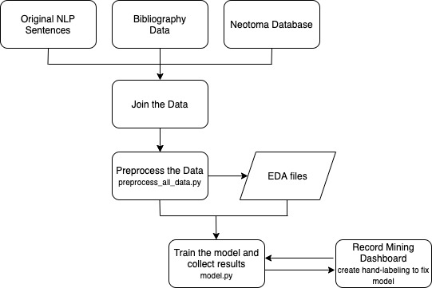

[](https://www.tidyverse.org/lifecycle/#experimental)
[](https://nsf.gov/awardsearch/showAward?AWD_ID=1928366)

# DB Record Mining

This Repository belongs th ML Record Mining and its sole purpose is to provide a Dashboard for proper annotations and hand labeling.

## Contributors

This project is an open project, and contributions are welcome from any individual.  All contributors to this project are bound by a [code of conduct](CODE_OF_CONDUCT.md).  Please review and follow this code of conduct as part of your contribution.

  * [Simon Goring](http://www.goring.org/) [](https://orcid.org/0000-0002-2700-4605)
  * [Socorro Dominguez Vidana](https://sedv8808.github.io/) [](https://orcid.org/0000-0002-7926-4935)


### Tips for Contributing

Issues and bug reports are always welcome.  Code clean-up, and feature additions can be done either through branches.

All products of the Throughput Annotation Project are licensed under an [MIT License](LICENSE) unless otherwise noted.

## How to use this repository

Files and directory structure in the repository are as follows:
This structure might be modified as the project progresses.

```bash
throughput-ec/UnacquiredSitesDashboard/
├── input
│   └── predictions_train_dummy            # dummy file for reproducibility / output of ML Record Mining
├── output
│   └── db_val_dummy                       # dummy file for reproducibility / output of Dashboard
├── src                  
│   └── test_preprocess_all_data.py        # dashboard plotly script
├── .gitignore
├── CODE_OF_CONDUCT.md
├── db.Dockerfile
├── LICENSE
└── README.md
```

### Workflow Overview

This project uses the ML Record Mining output files:
* `predictions_train.tsv` predictions over sentences to assess whether they have coordinates or not.

These files are used as input in a Dashboard where people can correct the output by hand labeling.

### System Requirements

This project is developed using Python.  
It runs on a MacOS system.

### Data Requirements
The project pulls data from ML Record Mining output files.
For the sake of reproducibility, two dummy data files have been included.

### Key Outputs

This project will generate tsv files with human corrections in order to help improve ML model.

## Pipeline
The current pipeline that is followed is:
\n
\n




### Instructions

In order to run the Dashboard and help hand labeling new data, please follow these instructions.

##### Docker Dashboard

1. Clone/download this repository.
2. Using the command line, go to the root directory of this repository.
3. Get the [unacquired_sites_db_app](https://hub.docker.com/repository/docker/sedv8808/unacquired_sites_db_app) image from [DockerHub](https://hub.docker.com/) from the command line:
```
docker pull sedv8808/unacquired_sites_db_app
```
4. Verify you are in the root directory of this project. Type the following (filling in *\<Path_on_your_computer\>* with the absolute path to the root of this project on your computer).

```
docker run -v <User's Path>/sentences.tsv:/app/input/ -v <User's Path>/output/:/app/output -p 8050:8050 sedv8808/unacquired_sites_db_app:latest
```

5. Go to your internet browser and enter the following address:
    http://0.0.0.0:8050/

6. Navigate through the different articles and mark the sentences that have coordinates.

7. Click the save button once you finish ONE article.

8. Sentences will be saved in the output/ folder. Kindly send those outputs to us.

##### Without Docker and to review other scripts.

This repository consists of 1 Python script.

In order to run this project, you need to:
1. Clone or download this repository.

2. Run the following code in the terminal at the project's root repository.
To run the scripts:

```
# From the command line.

# Load dashboard
python3 src/modules/dashboard/record_mining_dashboard.py --input_file=<data> --output_file=<directory>

# To visualize in your browser, enter the following http address.
http://127.0.0.1:8050/
```

## Running the dashboard
The Record Mining Machine Learning Dashboard can help the user identify sentences that are incorrectly tagged and so, fix the problem.
